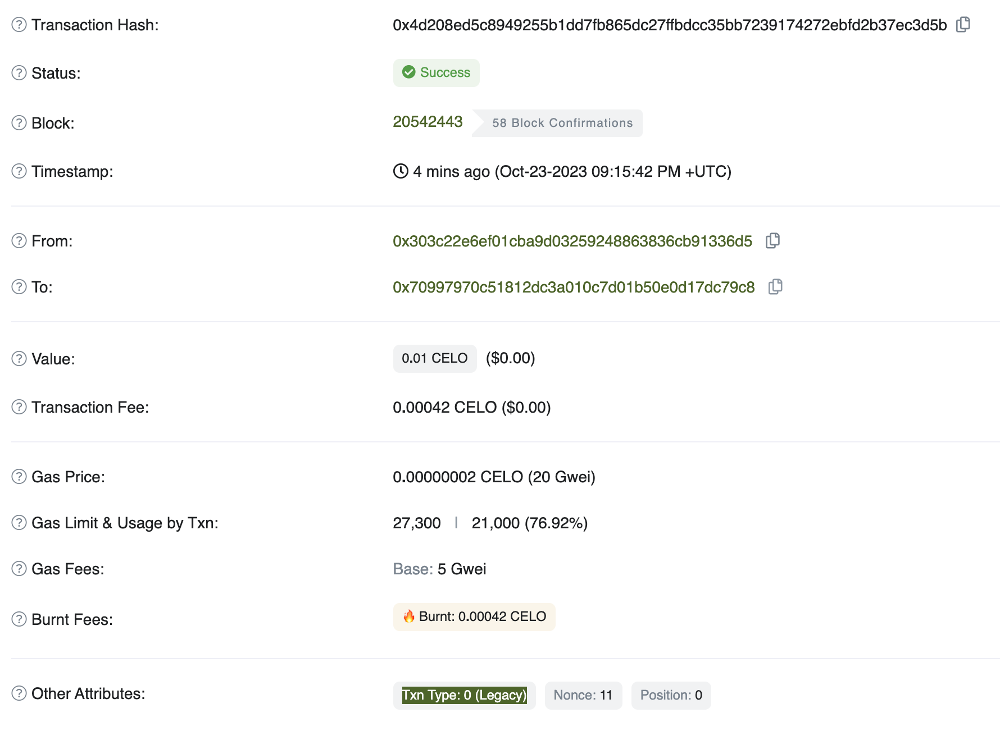
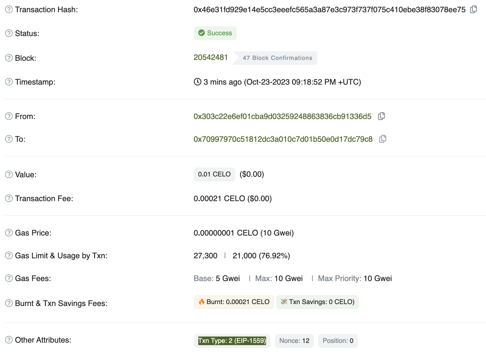
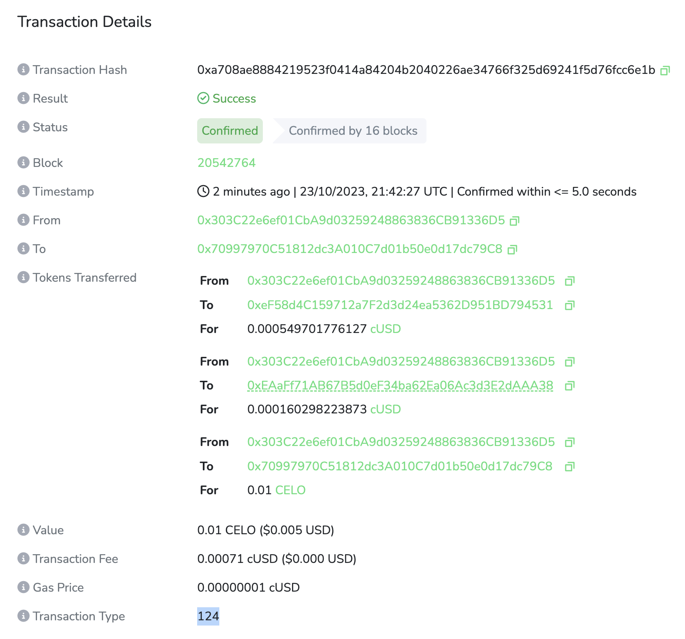

# Transaction types on Celo

This repo contains an explainer on transaction types supported on Celo and a demo to make specific 
transactions.

> **Warning**
> This repo is for educational purposes only. The information provided here may be inaccurate. 
> Please don’t rely on it exclusively to implement low-level client libraries.

## Summary

Celo has support for all Ethereum transaction types (i.e. "100% Ethereum compatibility") 
and a single Celo transaction type. 

### Actively supported on Celo

| Chain | Transaction type  | # | Specification | Recommended | Support | Comment |
|---|---|---|---|---|---|---|
|  | Dynamic fee transaction v2 | `123` | [CIP-64](https://github.com/celo-org/celo-proposals/blob/master/CIPs/cip-0064.md) | ✅ | Active 🟢 | Supports paying gas in custom fee currencies |
|  | Dynamic fee transaction | `2` | [EIP-1559](https://eips.ethereum.org/EIPS/eip-1559) ([CIP-42](https://github.com/celo-org/celo-proposals/blob/master/CIPs/cip-0042.md)) | ✅ | Active 🟢 | Typical Ethereum transaction |
|  | Access list transaction | `1` | [EIP-2930](https://eips.ethereum.org/EIPS/eip-2930) ([CIP-35](https://github.com/celo-org/celo-proposals/blob/master/CIPs/cip-0035.md)) | ❌ | Active 🟢 | Does not support dynamically changing _base fee_ per gas  | 
|  | Legacy transaction | `0` | [Ethereum Yellow Paper](https://ethereum.github.io/yellowpaper/paper.pdf) ([CIP-35](https://github.com/celo-org/celo-proposals/blob/master/CIPs/cip-0035.md)) | ❌ | Active 🟢 | Does not support dynamically changing _base fee_ per gas |

### At risk of deprecation on Celo

| Chain | Transaction type  | # | Specification | Recommended | Support | Comment |
|---|---|---|---|---|---|---|
|  | Dynamic fee transaction | `124` | [CIP-42](https://github.com/celo-org/celo-proposals/blob/master/CIPs/cip-0042.md) | ❌ | Security 🟠 | Deprecation warning published in [Gingerbread hard fork](https://github.com/celo-org/celo-proposals/blob/8260b49b2ec9a87ded6727fec7d9104586eb0752/CIPs/cip-0062.md#deprecation-warning) |
|  | Legacy transaction | `0` | Celo Mainnet launch ([Blockchain client v1.0.0](https://github.com/celo-org/celo-blockchain/tree/celo-v1.0.0)) | ❌ | Security 🟠 | Deprecation warning published in [Gingerbread hard fork](https://github.com/celo-org/celo-proposals/blob/8260b49b2ec9a87ded6727fec7d9104586eb0752/CIPs/cip-0062.md#deprecation-warning) |

The stages of support are:

-   **Active support** 🟢: the transaction type is supported and recommended for use.
-   **Security support** 🟠: the transaction type is supported but not recommended for use
    because it might be deprecated in the future.
-   **Deprecated** 🔴: the transaction type is not supported and not recommended for use.

### Client library support

Legend:

-    = support for the recommended Ethereum transaction type (`2`)
-    = support for the recommended Celo transaction type (`123`)

| Client library | Language |  | since |  | since | Comment |
|---|:---:|:---:|:---:|:---|---|---|
| `viem` | TS/JS | ✅ | | 🟠 | | [In progress](https://github.com/wagmi-dev/viem/pull/1379) | 
| `ethers` | TS/JS | ✅ | |  ❌ | | Support via fork in <br> `celo-ethers-wrapper` | 
| `celo-ethers-wrapper` | TS/JS | ✅ | | ✅ | | --- |
| `web3js` | TS/JS | ✅ | |  ❌ | | Support via fork in  <br> `contractkit` |
| `contractkit` | TS/JS | ✅ |  | ✅ | >[v5.0.0](https://github.com/celo-org/celo-monorepo/releases/tag/v5.0) | --- |
| `Web3j` | Java | ✅ | |  ❌ |  | --- |
| `rust-ethers` | Rust |  ✅ | | ❌ | | --- |
| `brownie` | Python |  ✅ | | ❌ | | --- |

## Background

### Legacy transactions

Ethereum originally had one format for transactions (now called "legacy transactions"). 
A legacy transaction contains the following transaction parameters:
`nonce`, `gasPrice`, `gasLimit`, `recipient`, `amount`, `data`, and `chaindId`.

To produce a valid "legacy transaction":

1.  the **transaction parameters** are [RLP-encoded](https://eth.wiki/fundamentals/rlp): 

    ```
    RLP([nonce, gasprice, gaslimit, recipient, amount, data, chaindId, 0, 0])
    ```

1.  the RLP-encoded transaction is hashed (using Keccak256).

1.  the hash is signed with a private key using the ECDSA algorithm, which generates the `v`, `r`, 
    and `s` **signature parameters**.

1.  the transaction _and_ signature parameters above are RLP-encoded to produce a valid **signed 
    transaction**:

    ```
    RLP([nonce, gasprice, gaslimit, recipient, amount, data, v, r, s])
    ```

A valid signed transaction can then be submitted on-chain, and its raw parameters can be 
parsed by RLP-decoding the transaction.

### Typed transactions

Over time, the Ethereum community has sought to add new types of transactions 
such as dynamic fee transactions 
([EIP-1559: Fee market change for ETH 1.0 chain](https://eips.ethereum.org/EIPS/eip-1559)) 
or optional access list transactions 
([EIP-2930: Optional access lists](https://eips.ethereum.org/EIPS/eip-2930)) 
to supported new desired behaviors on the network.

To allow new transactions to be supported without breaking support with the 
legacy transaction format, the concept of **typed transactions** was proposed in 
[EIP-2718: Typed Transaction Envelope](https://eips.ethereum.org/EIPS/eip-2718), which introduces 
a new high-level transaction format that is used to implement all future transaction types.

### Distinguishing between legacy and typed transactions

Whereas a valid "legacy transaction" is simply an RLP-encoded list of 
**transaction parameters**, a valid "typed transactions" is an arbitrary byte array 
prepended with a **transaction type**, where:

-   a **transaction type**, is a number between 0 (`0x00`) and 127 (`0x7f`) representing 
    the type of the transaction, and

-   a **transaction payload**, is arbitrary byte data that encodes raw transaction parameters 
    is compliance with the specified transaction type.

To distinguish between legacy transactions and typed transactions at the client level, 
the EIP designers observed that the **first byte** of a legacy transaction would never be in the range 
`[0, 0x7f]` (or `[0, 127]`), and instead always be in the range `[0xc0, 0xfe]` (or `[192, 254]`). 

With that observation, transactions can be decoded with the following heuristic:

-   read the first byte of a transaction
-   if it's bigger than `0x7f` (`127`), then it's a **legacy transaction**. To decode it you, 
    must read _all_ bytes (including the first byte just read) and interpret them as a 
    legacy transaction.
-   else, if it's smaller or equal to `0x7f` (`127`), then it's a **typed transaction**. To decode
    it you must read the _remaining_ bytes (excluding the first byte just read) and interpret them
    according to the specified transaction type.

Every transaction type is defined in an EIP, which specifies how to _encode_ as well as _decode_ 
transaction payloads. This means that a typed transaction can only be interpreted with knowledge of 
its transaction type and a relevant decoder.

## List of transaction types on Celo

###  Legacy transaction (`0`)

> **Info**
> This transaction type is 100% compatible with Ethereum and has no Celo-specific parameters.

Although legacy transactions are never formally prepended with the `0x00` transaction type, 
they are commonly referred to as "type 0" transactions.

-   This transaction is defined as follows:

    ```
    RLP([nonce, gasprice, gaslimit, recipient, amount, data, v, r, s])
    ```

-   It was introduced on Ethereum during Mainnet launch on [date CHECK] as specified in the
    [Ethereum Yellow Paper](https://ethereum.github.io/yellowpaper/paper.pdf).

-   It was introduced on Celo [during CHECK] on [date CHECK] as specified in 
    [CIP-35: Support for Ethereum-compatible transactions](https://github.com/celo-org/celo-proposals/blob/master/CIPs/cip-0035.md).

###  Access list transaction (`1`)

> **Info**
> This transaction type is 100% compatible with Ethereum and has no Celo-specific parameters.

-   This transaction is defined as follows:

    ```
    0x01 || RLP([chainId, nonce, gasPrice, gasLimit, to, value, data, accessList, signatureYParity, signatureR, signatureS])
    ```

-   It was introduced on Ethereum during the Ethereum Berlin hard fork on 
    [Apr, 15 2021](https://ethereum.org/en/history/#berlin) as specified in 
    [EIP-2930: Optional access lists](https://eips.ethereum.org/EIPS/eip-2930).

-   It was introduced on Celo [during CHECK] on [date CHECK] as specified in 
    [CIP-35: Support for Ethereum-compatible transactions](https://github.com/celo-org/celo-proposals/blob/master/CIPs/cip-0035.md).

###  Dynamic fee transaction (`2`)

> **Info**
> This transaction type is 100% compatible with Ethereum and has no Celo-specific parameters.

-   This transaction is defined as follows:

    ```
    0x02 || RLP([chainId, nonce, maxPriorityFeePerGas, maxFeePerGas, gasLimit, to, value, data, accessList, signatureYParity, signatureR, signatureS])
    ```
    
-   It was introduced on Ethereum during the Ethereum London hard fork on 
    [Aug, 5 2021](https://ethereum.org/en/history/#london) as specified in
    [EIP-1559: Fee market change for ETH 1.0 chain](https://eips.ethereum.org/EIPS/eip-1559).

-   It was introduced on Celo during the
    [Celo Espresso hard fork](https://github.com/celo-org/celo-proposals/blob/master/CIPs/cip-0041.md)
    on [Mar, 8 2022](https://blog.celo.org/brewing-the-espresso-hardfork-92a696af1a17) as specified
    in [CIP-42: Modification to EIP-1559](https://github.com/celo-org/celo-proposals/blob/master/CIPs/cip-0042.md)

###  Legacy transaction (`0`)

> **Info**
> This transaction is not compatible with Ethereum and has three Celo-specific 
> parameters: `feecurrency`, `gatewayfeerecipient`, and `gatewayfee`.

-   This transaction is defined as follows:

    ```
    RLP([nonce, gasprice, gaslimit, feecurrency, gatewayfeerecipient, gatewayfee, recipient, amount, data, v, r, s])
    ```
    
-   It was introduced on Celo during Mainnet launch on 
    [Apr, 22 2020](https://dune.com/queries/3106924/5185945) as specified in 
    [Blockchain client v1.0.0](https://github.com/celo-org/celo-blockchain/tree/celo-v1.0.0).

###  Dynamic fee transaction (`124`)

> **Info**
> This transaction is not compatible with Ethereum and has three Celo-specific 
> parameters: `feecurrency`, `gatewayfeerecipient`, and `gatewayfee`.

-   This transaction is defined as follows:

    ```
    0x7c || RLP([chain_id, nonce, max_priority_fee_per_gas, max_fee_per_gas, gas_limit, feecurrency, gatewayfeerecipient, gatewayfee, destination, amount, data, access_list, v, r, s])
    ```
    
-   It was introduced on Celo during the 
    [Celo Espresso hard fork](https://github.com/celo-org/celo-proposals/blob/master/CIPs/cip-0041.md)
    on [Mar, 8 2022](https://blog.celo.org/brewing-the-espresso-hardfork-92a696af1a17) as specified 
    in [CIP-42: Modification to EIP-1559](https://github.com/celo-org/celo-proposals/blob/master/CIPs/cip-0042.md).

###  Dynamic fee transaction v2 (`123`)

> **Info**
> This transaction is not compatible with Ethereum and has one Celo-specific 
> parameter: `feecurrency`.

-   This transaction is defined as follows:

    ```
    0x7b || RLP([chainId, nonce, maxPriorityFeePerGas, maxFeePerGas, gasLimit, to, value, data, accessList, feeCurrency, v, r, s])
    ```

-   It was introduced on Celo during the 
    [Celo Gingerbread hard fork](https://github.com/celo-org/celo-proposals/blob/8260b49b2ec9a87ded6727fec7d9104586eb0752/CIPs/cip-0062.md) 
    on [Sep, 26 2023](https://forum.celo.org/t/mainnet-alfajores-gingerbread-hard-fork-release-sep-26-17-00-utc/6499)
    as specified in 
    [CIP-64: New Transaction Type: Celo Dynamic Fee v2](https://github.com/celo-org/celo-proposals/blob/master/CIPs/cip-0064.md)


## Demo usage

### Requirements

-   Celo account with 1 CELO and 1 cUSD on Alfajores (you can get free testnet tokens from 
    [faucet.celo.org](https://faucet.celo.org/alfajores))
-   Node.js v18.14.2

### Install dependencies

```sh
yarn install
# or
npm install
```

### Set up environment variables

Create a `.env` file in the root directory of the project:

```sh
cp .env.example .env
```

Paste the private key of an account that has CELO and cUSD on Alfajores into the `.env` file.

### Run the demo

```sh
yarn demo
# or
npm demo
```

### [Legacy transaction demo](https://alfajores.celoscan.io/tx/0x4d208ed5c8949255b1dd7fb865dc27ffbdcc35bb7239174272ebfd2b37ec3d5b)

```sh
~/Documents/txtypes main $ yarn demo
yarn run v1.22.19
$ ts-node demo.ts
Initiating legacy transaction...
Legacy transaction: 0x4d208ed5c8949255b1dd7fb865dc27ffbdcc35bb7239174272ebfd2b37ec3d5b 

Legacy transaction receipt {
  blockHash: '0x8c17c2ca9d4e2134c6ee14c55a516e9b59aa341647c6e8719a455f1cd4ca4123',
  blockNumber: 20542443n,
  contractAddress: null,
  cumulativeGasUsed: 21000n,
  effectiveGasPrice: 20000000000n,
  from: '0x303c22e6ef01cba9d03259248863836cb91336d5',
  gasUsed: 21000n,
  logs: [],
  logsBloom: '0x00000000000000000000000000000000000000000000000000000000000000000000000000000000000000000000000000000000000000000000000000000000000000000000000000000000000000000000000000000000000000000000000000000000000000000000000000000000000000000000000000000000000000000000000000000000000000000000000000000000000000000000000000000000000000000000000000000000000000000000000000000000000000000000000000000000000000000000000000000000000000000000000000000000000000000000000000000000000000000000000000000000000000000000000000000000',
  status: 'success',
  to: '0x70997970c51812dc3a010c7d01b50e0d17dc79c8',
  transactionHash: '0x4d208ed5c8949255b1dd7fb865dc27ffbdcc35bb7239174272ebfd2b37ec3d5b',
  transactionIndex: 0,
  type: 'legacy',
  feeCurrency: undefined,
  gatewayFee: null,
  gatewayFeeRecipient: undefined
} 

See in explorer: https://alfajores.celoscan.io/tx/0x4d208ed5c8949255b1dd7fb865dc27ffbdcc35bb7239174272ebfd2b37ec3d5b 

✨  Done in 11.10s.
```



### [Dynamic fee transaction demo](https://alfajores.celoscan.io/tx/0x46e31fd929e14e5cc3eeefc565a3a87e3c973f737f075c410ebe38f83078ee75)

```sh
~/Documents/txtypes main $ yarn demo
yarn run v1.22.19
$ ts-node demo.ts
Initiating dynamic fee (EIP-1559) transaction...
Dynamic fee (EIP-1559) transaction: 0x46e31fd929e14e5cc3eeefc565a3a87e3c973f737f075c410ebe38f83078ee75 

Dynamic fee (EIP-1559) transaction receipt {
  blockHash: '0x4c395840bf21e858a2dc4798305f569598d79b0b07f3e7eda5e92ae301037645',
  blockNumber: 20542481n,
  contractAddress: null,
  cumulativeGasUsed: 21000n,
  effectiveGasPrice: 10000000000n,
  from: '0x303c22e6ef01cba9d03259248863836cb91336d5',
  gasUsed: 21000n,
  logs: [],
  logsBloom: '0x00000000000000000000000000000000000000000000000000000000000000000000000000000000000000000000000000000000000000000000000000000000000000000000000000000000000000000000000000000000000000000000000000000000000000000000000000000000000000000000000000000000000000000000000000000000000000000000000000000000000000000000000000000000000000000000000000000000000000000000000000000000000000000000000000000000000000000000000000000000000000000000000000000000000000000000000000000000000000000000000000000000000000000000000000000000',
  status: 'success',
  to: '0x70997970c51812dc3a010c7d01b50e0d17dc79c8',
  transactionHash: '0x46e31fd929e14e5cc3eeefc565a3a87e3c973f737f075c410ebe38f83078ee75',
  transactionIndex: 0,
  type: 'eip1559',
  feeCurrency: undefined,
  gatewayFee: null,
  gatewayFeeRecipient: undefined
} 

See in explorer: https://alfajores.celoscan.io/tx/0x46e31fd929e14e5cc3eeefc565a3a87e3c973f737f075c410ebe38f83078ee75 

✨  Done in 11.16s.
```



### [Custom fee currency demo](https://explorer.celo.org/alfajores/tx/0xa708ae8884219523f0414a84204b2040226ae34766f325d69241f5d76fcc6e1b)

```sh
~/Documents/txtypes main $ yarn demo
yarn run v1.22.19
$ ts-node demo.ts
Initiating custom fee currency transaction...
Custom fee currency transaction: 0xa708ae8884219523f0414a84204b2040226ae34766f325d69241f5d76fcc6e1b 

Custom fee currency transaction receipt {
  blockHash: '0xe6f7c202a946ea06d2ebc2032cb82a58822f1a6110afdb9cf3818d827b3fc173',
  blockNumber: 20542764n,
  contractAddress: null,
  cumulativeGasUsed: 71000n,
  effectiveGasPrice: 10000000000n,
  from: '0x303c22e6ef01cba9d03259248863836cb91336d5',
  gasUsed: 71000n,
  logs: [
    {
      address: '0x874069fa1eb16d44d622f2e0ca25eea172369bc1',
      topics: [Array],
      data: '0x000000000000000000000000000000000000000000000000000091ca56b12be8',
      blockNumber: 20542764n,
      transactionHash: '0xa708ae8884219523f0414a84204b2040226ae34766f325d69241f5d76fcc6e1b',
      transactionIndex: 0,
      blockHash: '0xe6f7c202a946ea06d2ebc2032cb82a58822f1a6110afdb9cf3818d827b3fc173',
      logIndex: 0,
      removed: false
    },
    {
      address: '0x874069fa1eb16d44d622f2e0ca25eea172369bc1',
      topics: [Array],
      data: '0x0000000000000000000000000000000000000000000000000001f3f36b193418',
      blockNumber: 20542764n,
      transactionHash: '0xa708ae8884219523f0414a84204b2040226ae34766f325d69241f5d76fcc6e1b',
      transactionIndex: 0,
      blockHash: '0xe6f7c202a946ea06d2ebc2032cb82a58822f1a6110afdb9cf3818d827b3fc173',
      logIndex: 1,
      removed: false
    }
  ],
  logsBloom: '0x00000000080000000000000000000000000000000000000000000000000000000000000000000000000080000000000000000000000000000000000000100000000000000000000000000008000000000000000000000000000008000000000000000000000000000000000000000000000000800000000000000011000000000000000800000000000000000000000000400000000000000000000000000000000000000000000000000000000000000000000000000000000000000000000000000202000000000000008008000000000000000000000000000000000000000000000020000000000000000000000000000000000000000000000000000000',
  status: 'success',
  to: '0x70997970c51812dc3a010c7d01b50e0d17dc79c8',
  transactionHash: '0xa708ae8884219523f0414a84204b2040226ae34766f325d69241f5d76fcc6e1b',
  transactionIndex: 0,
  type: '0x7c',
  feeCurrency: undefined,
  gatewayFee: null,
  gatewayFeeRecipient: undefined
} 

See in explorer: https://explorer.celo.org/alfajores/tx/0xa708ae8884219523f0414a84204b2040226ae34766f325d69241f5d76fcc6e1b 

✨  Done in 11.19s.
```



## Todos

-   [x] CHECK: That any valid typed or untyped Ethereum transaction is valid on Celo ?
    All transactions (legacy and newly typed Ethereum transactions) are valid on Celo

-   [x] CHECK: Does Celo support 0x00 typed Celo-specific transactions?
    Yes, there is no specific 0x00 typed transactions, legacy transactions are simply accepted and implied to be of type 0 (althought they are not prefixed with `0x00 || ...`)

-   [x] CHECK: Does Celo support access list with Celo-specific parameters
    No, Celo only supports accessList via EIP-1559 Ethereum transactions (type 0x02) and Celo dynamic fee v2 transactions (type 0x7b), there is no Celo-specific access list transaction type (with the legacy format, i.e. no max gas fee and Celo-specific parameters)

-   [x] CHECK: Does Celo support access list with legacy gasLimit field instead of EIP-1559
    Yes, Celo supports access list in Ethereum access list transcactions (i.e. with legacy gasLimit field instead of EIP-1559)

-   Demo all recommended and supported transaction types
    -   [ ] Celo CIP-64 transaction (the only Celo-specific transaction type recommended and supported long-term)
    -   [ ] Ethereum EIP-1559 transaction
    -   [ ] Ethereum access list transaction
    -   [ ] Ethereum legacy transaction

-   [ ] Specify that all Ethereum transactions are valid on Celo

-   [ ] Consider using "Active Support" and	"Security Support" terminology for the deprecation warnings (like here [endoflife.date/nodejs](https://endoflife.date/nodejs))
